# Building single agent applications on databricks

## Understanding AI Agents
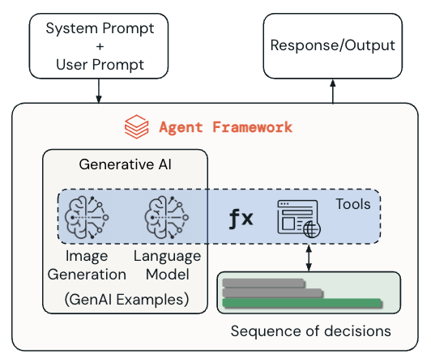

## Core Components of AI Agents
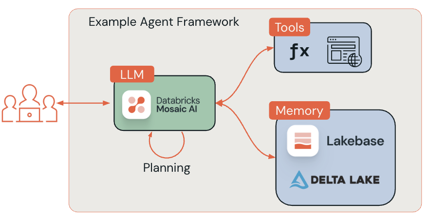

## Unity Catalog and Agent Tool Governance
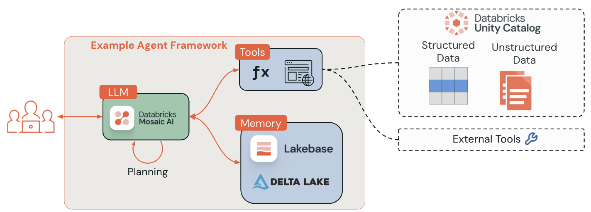

## Documentation Best Practices
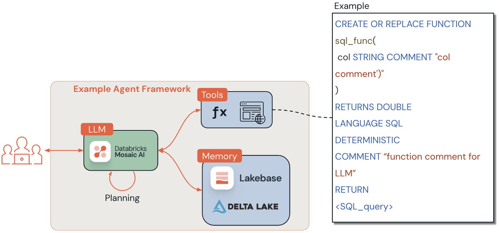

## SQL vs Python Agent Tools: Key Differences and Use Cases
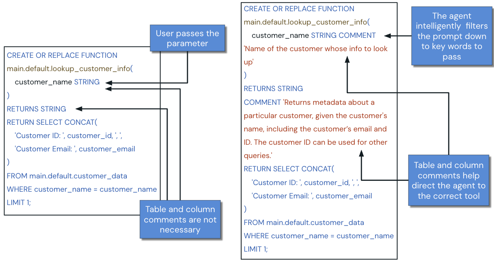

## Example Agent Framework
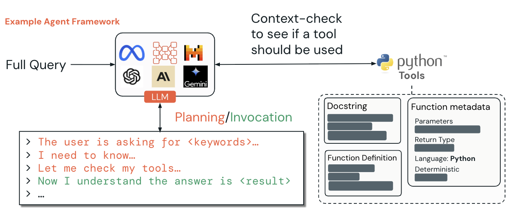

## Function Registration Methods
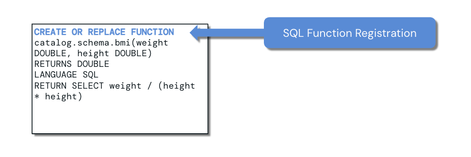

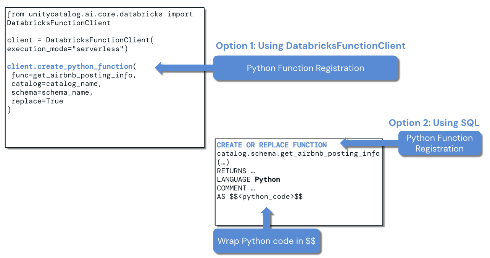

## Tool Registration Validation with UI
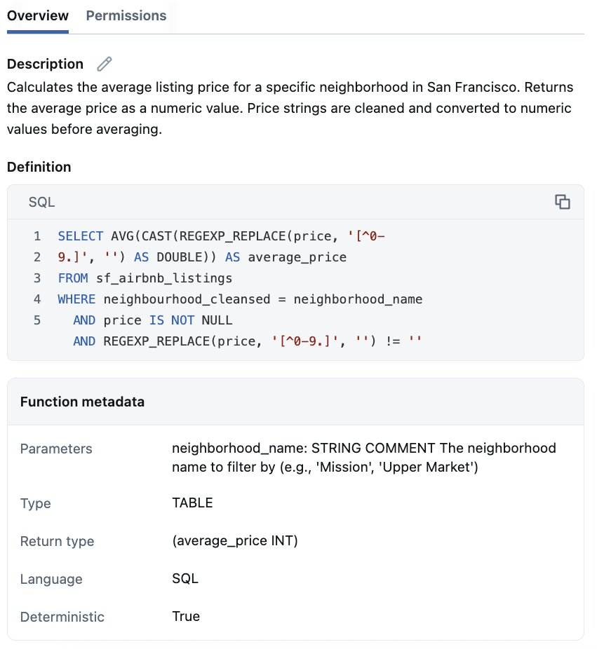

## An example of a SQL UC function
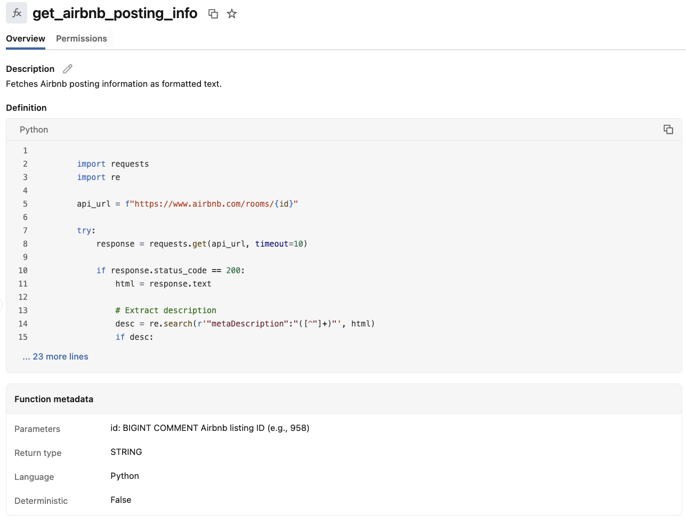

## AI Playground Integration
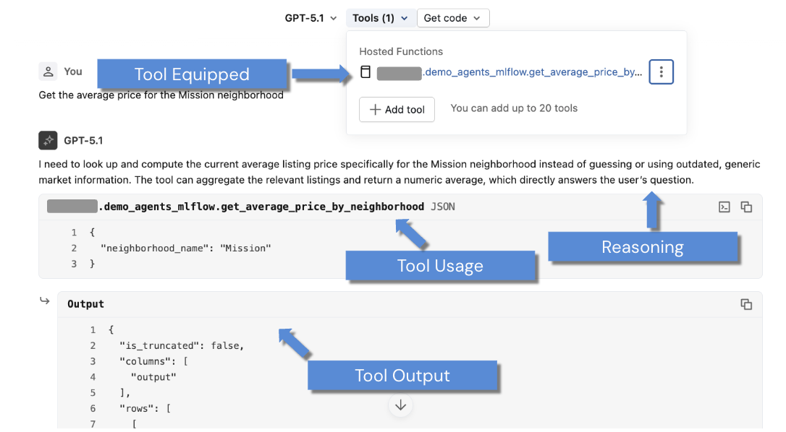

## Introduction to Mosaic AI Agent Framework
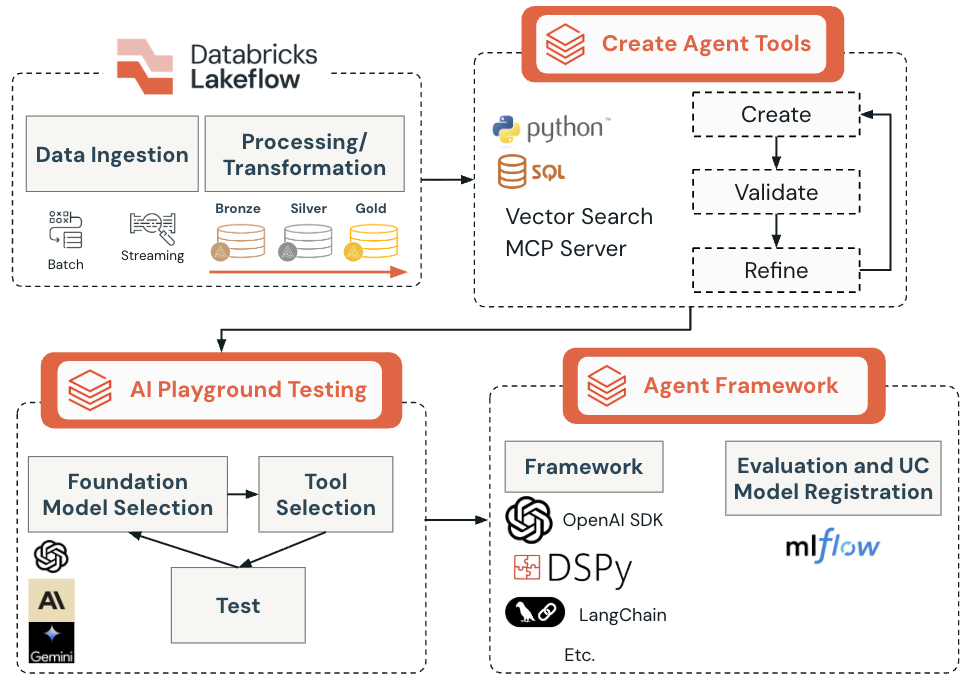

## Streaming Implementation
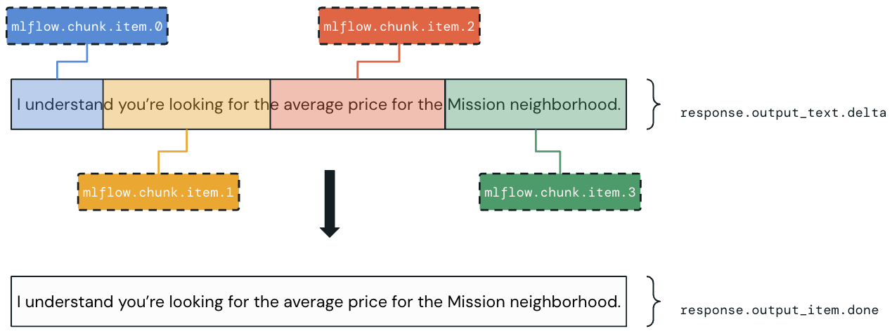

## Models in Unity Catalog for Agent Governance
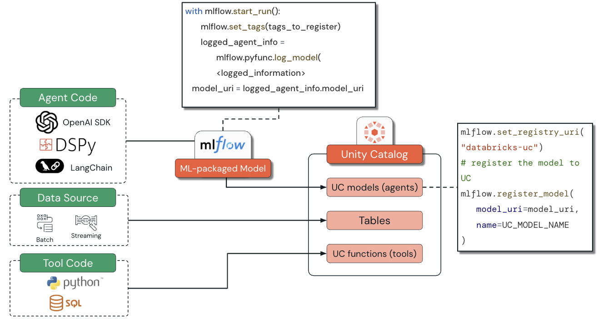

## Introduction to Agent Bricks
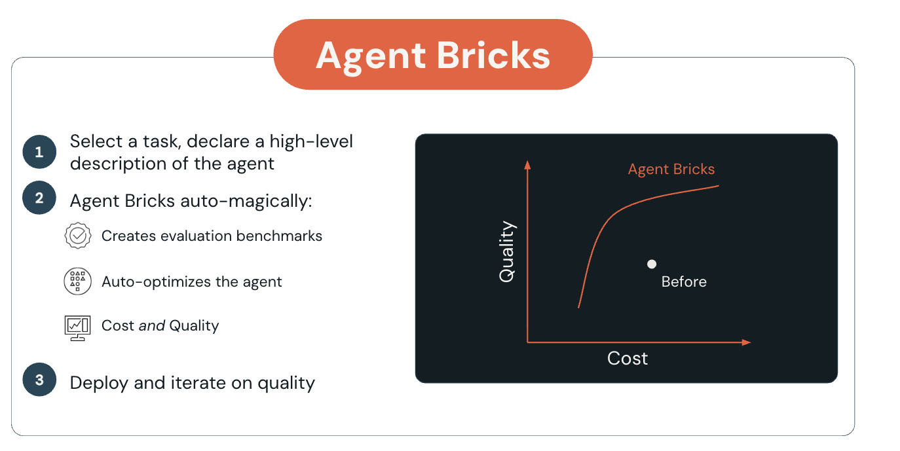

## Operational Categories
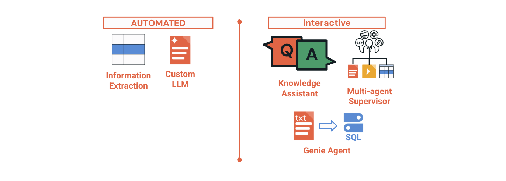

## Core Three-Step Development Cycle
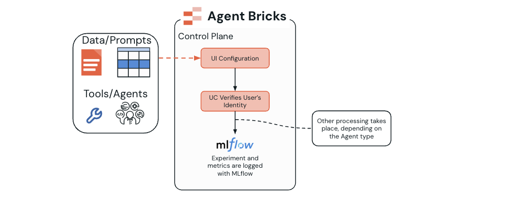

## Optimize on Your Enterprise Data
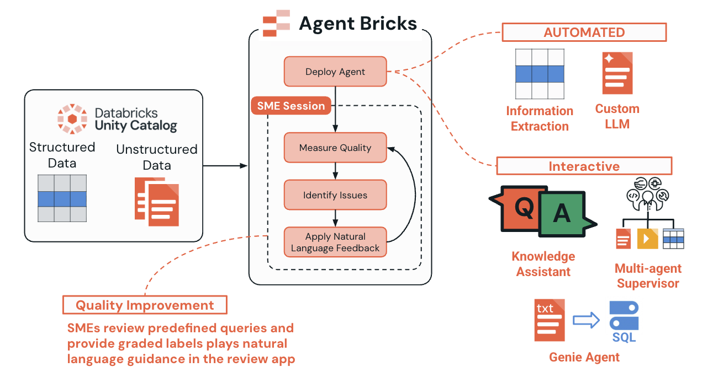

## Integration with Other Services
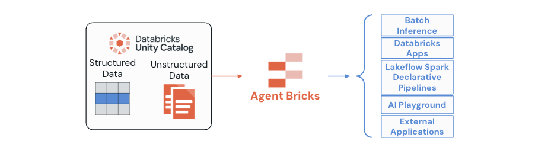