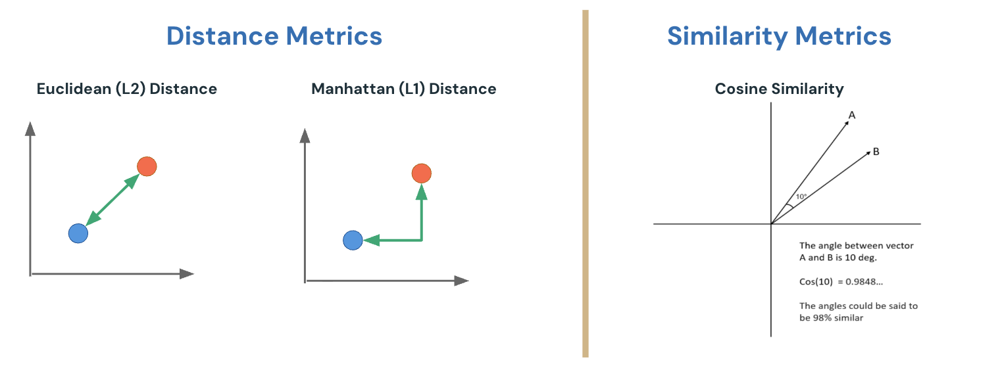
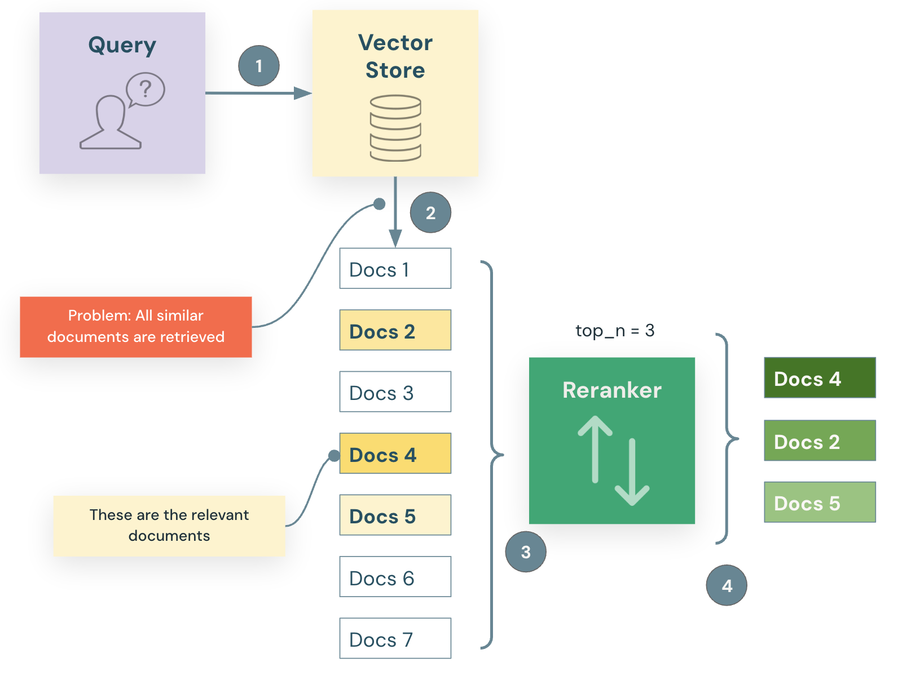
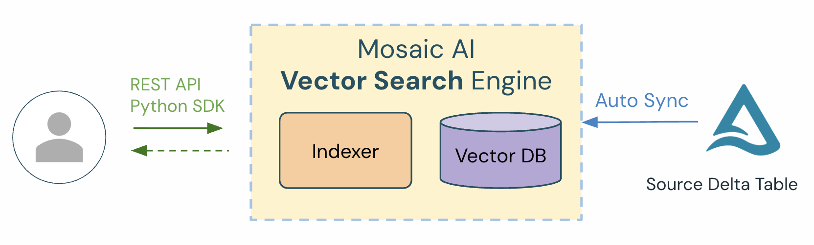
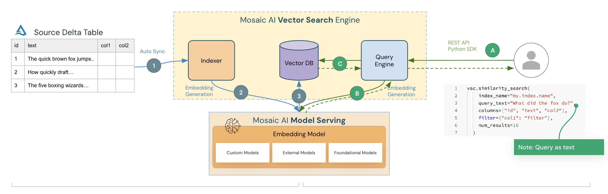
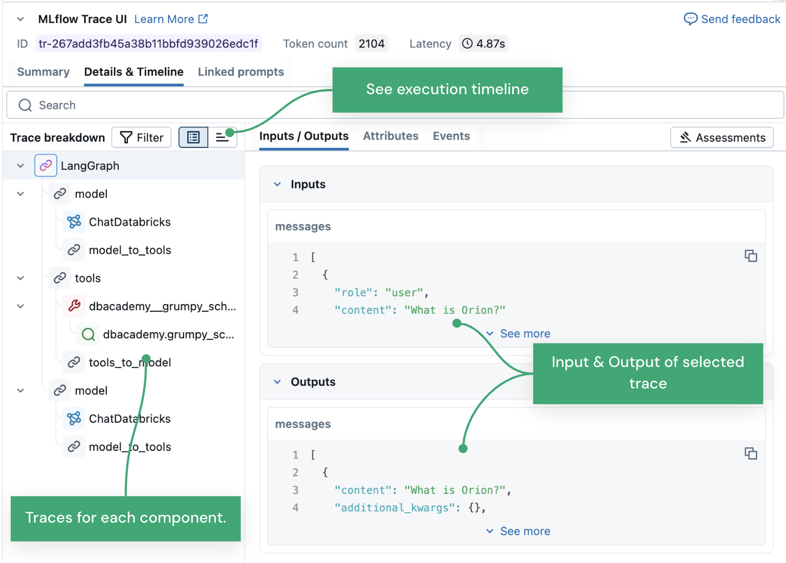
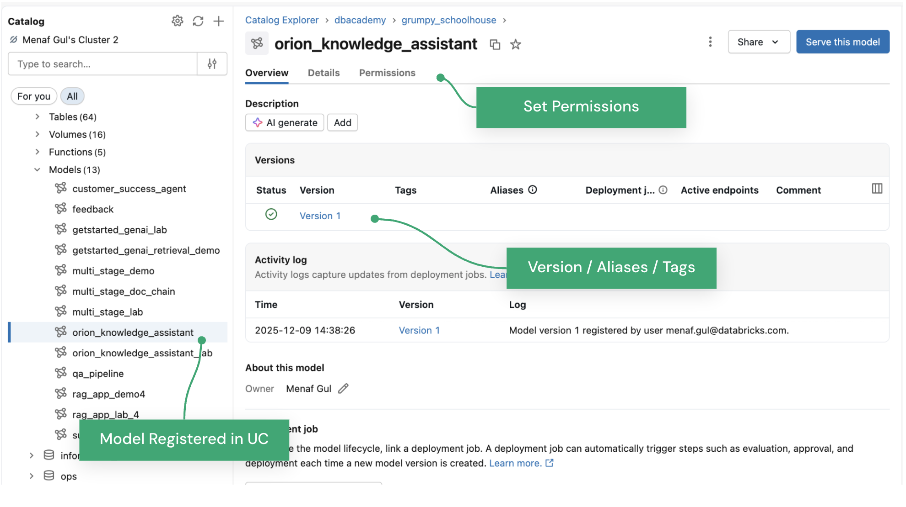
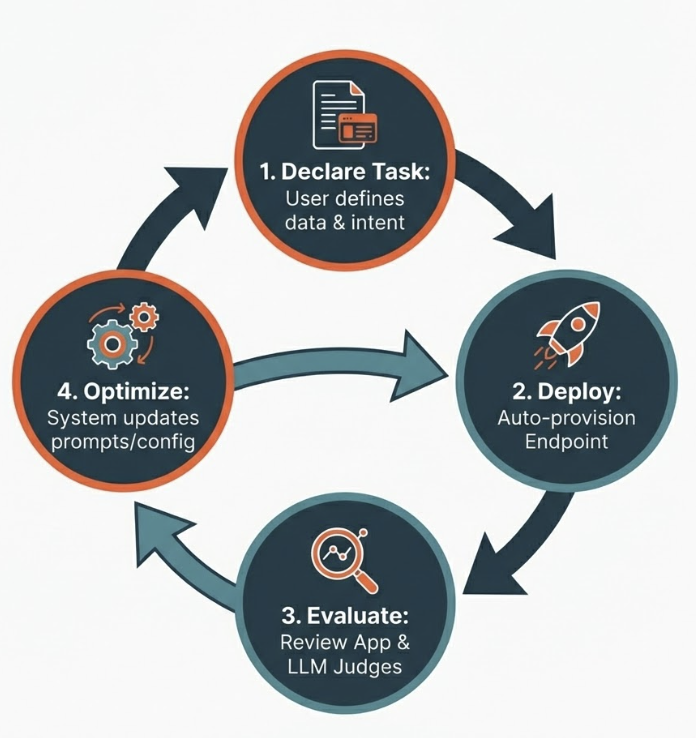
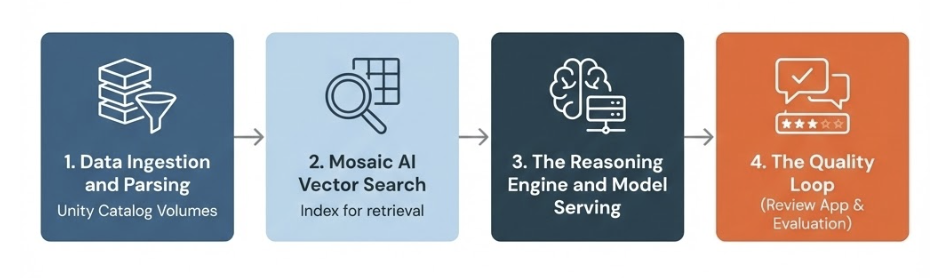

Data Bricks Compelete High Level Notes

## Data Storage and Processing Architecture

## Document Processing Challenges

## Fixed-Size vs. Recursive Chunking

## Advanced Chunking Strategies

## Embedding Models: 
 This illustration demonstrates how data chunks are processed by an embedding model to generate vectors. If the input data exceeds the model's context window limit, the excess content is omitted, which can impact the completeness of the resulting embeddings.

## Distance and Similarity Metrics

## The Reranking Process

## Mosaic AI Vector Search - Features and Architecture

## Management and Ingestion Modes

## MLFlow Tracing UI

## Logging and Registering Agents

## The Agents Brick Solution

## Knowledge Assistant Components
